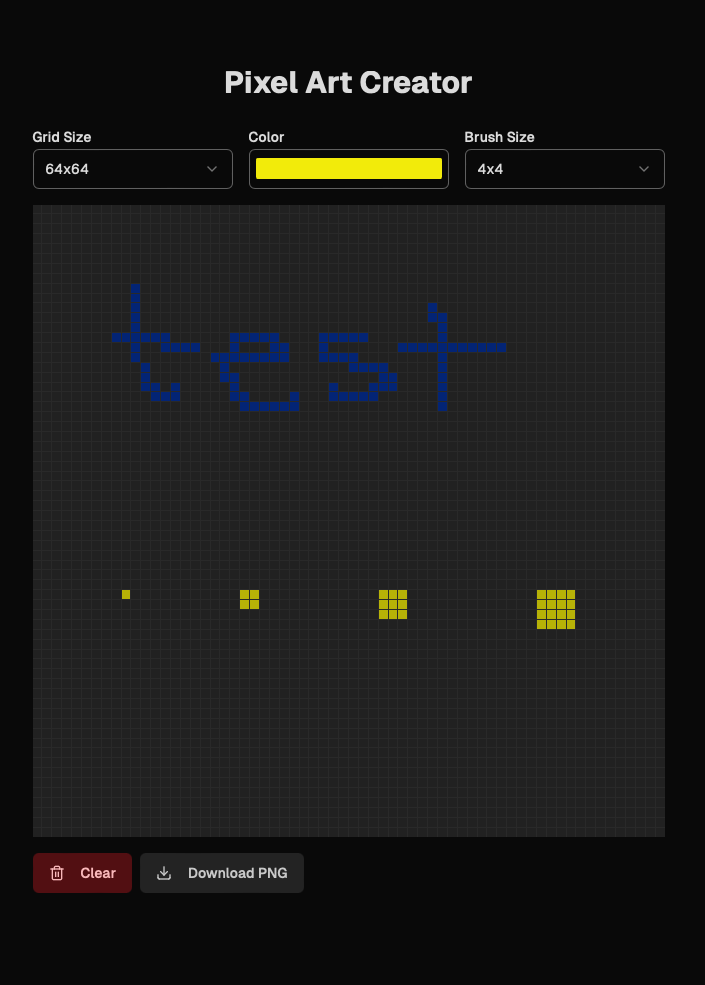

# Pixel Art Creator

## Overview
This project is a simple **Pixel Art Creator** built with Next.js and TypeScript. It allows users to create pixel art by selecting a grid size, picking a color, choposing a brush size, and drawing on the grid by clicking and dragging. Users can then save the image locally.

## First Iteration Features
- **Grid Size Selector**: Users can choose from different grid sizes (8x8, 16x16, 32x32, 64x64) to set the canvas dimensions.
- **Color Picker**: A color input lets users select a color for drawing.
- **Clear Canvas**: A button clears the entire canvas, resetting all pixels to the default color.

## Second Iteration Features
- **Brush Size Selector**: Users can choose from different brush sizes (1x1, 2x2, 4x4) to set the size of the brush.
- **Download PNG**: A button downloads the current state of the canvas as a PNG image.

## How It Works
- The grid size is managed with the `useState` hook, and the pixel data is stored in an array that updates when the user interacts with the grid.
- The `handleMouseDown`, `handleMouseEnter`, and `handleMouseUp` functions handle the drawing interactions, allowing the user to click and drag to paint on the grid.
- The `clearCanvas` function resets the pixel array, effectively clearing the drawing.

## Learning Experience
- **Use of v0**: This (and the previous time I had used v0 for this assignment the first time around) was my first time using v0. I was impressed with the ease of use, the speed, and the relatively decent code quality. I have/had both Claude Premium abnd OpenAI premium and I think the code quality was comaprable to those paid platforms, although this was my first time coding in a Next.js environment.
- **TypeScript**: This project helped me understand TypeScript’s type-checking capabilities, especially with props and state.
- **Next.js**: This was my first time using Next.js and I think it's a great framework for building web apps. The routing is easy and the code is well organized.

## Screenshot
Here are screenshots of the Pixel Art Creator app:

*This image shows the main interface with the grid, color picker, and controls.*

*This image shows the main interface with the grid, color picker, brush size selector, and controls.*
